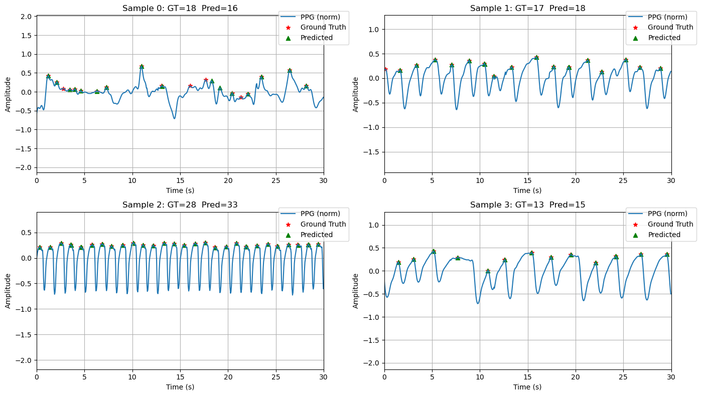

# Heart Rhythm Analysis
By: [Shayan Riyaz](https://shayanriyaz.github.io)

## Motivation:
The purpose of this project is to explore Heart Rhythms using:
1) Signal Processing Techniques
2) Machine/Deep Learning
3) Causal Analysis/Inference

## Goal:

### Step 1) Using Deep Learning to PPG Peaks 

## Dataset
Currently I am using small AFib/NSR Dataset (~35 subjects) from the MIMIC III via physionet. I converted **[Peter Charlton's](https://github.com/peterhcharlton/ppg-beats)** [collate_mimic_perform_af_dataset](https://github.com/peterhcharlton/ppg-beats/blob/main/source/collate_mimic_perform_af_dataset.m) script for extracting the data from Matlab to python. (Using a max of LLMs and my own intuiton). Next I used the [MSPTDfast](https://iopscience.iop.org/article/10.1088/1361-6579/adb89e) peak detection [algorithm](https://github.com/peterhcharlton/ppg-beats/blob/main/source/msptdfastv2_beat_detector.m) (again by Peter Charlton & again converted using LLM and my own understanding of the algorithm.). 
**Future Plans**: Add more datasets to train and test model.

## Model Development
- 

## References
- Charlton, P. H., Prada, E. J. A., Mant, J., & Kyriacou, P. A. (2025). The MSPTDfast photoplethysmography beat detection algorithm: design, benchmarking, and open-source distribution. Physiological Measurement. https://doi.org/10.1088/1361-6579/adb89e
- Charlton, P. H. (n.d.). PPG-Beats. https://ppg-beats.readthedocs.io/en/latest/
**AF Annotations**
-  https://figshare.com/articles/dataset/Atrial_Fibrillation_annotations_of_electrocardiogram_from_MIMIC_III_matched_subset/12149091/1 